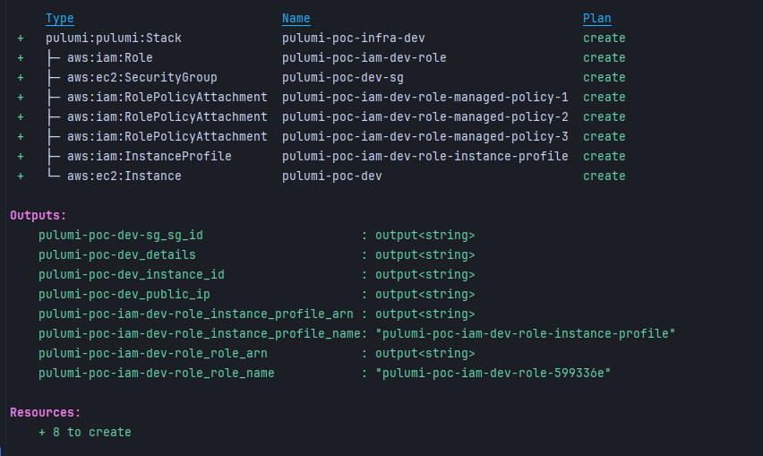

# pulumi-declarative

This repository contains a Pulumi-based infrastructure project with support for managing two separate environments: **Development** (`dev`) and **Production** (`prod`). The project uses Pulumi's Infrastructure as Code (IaC) framework to define, configure, deploy, and manage infrastructure resources.

---

## Requirements

Make sure you have the following tools and dependencies installed:

### Tools

1. **Pulumi CLI** (>= 3.0.0, < 4.0.0)  
   [Pulumi Installation Guide](https://www.pulumi.com/docs/get-started/install/)
2. **Python** (>= 3.7)  
   [Download Python](https://www.python.org/downloads/)
3. **AWS CLI** (to configure AWS credentials and regions)  
   [Install AWS CLI](https://aws.amazon.com/cli/)

### Python Dependencies

Ensure you have the following dependencies listed in a `requirements.txt` file:

```plaintext
pulumi>=3.0.0,<4.0.0
pulumi-aws>=6.0.2,<7.0.0
```

Install the dependencies using:

```bash
pip install -r requirements.txt
```

---

## Setting Up Your Pulumi Environments

This project is built to support two isolated environments: `dev` and `prod`. You can configure and manage infrastructure independently for both environments.

### Initialization Steps

1. **Login to Pulumi Backend**
   Pulumi supports multiple backends for storing state (e.g., local file system, Pulumi Cloud).
    - For local storage, run:
      ```bash
      pulumi login --local
      ```
    - For other supported backends, see [Pulumi Backends Documentation](https://www.pulumi.com/docs/intro/concepts/state/).

2. **Initialize the Pulumi Project and Stacks**
   Use the following commands to set up your project and initialize environment-specific stacks:

    - For the **dev** environment:
      ```bash
      pulumi stack init dev
      ```
    - For the **prod** environment:
      ```bash
      pulumi stack init prod
      ```

3. **Configure Environment Variables**
   Each stack can have its own custom configuration keys. For instance, configuring the AWS region:

    - For the `dev` stack:
      ```bash
      pulumi config set aws:region us-east-1 --stack dev
      ```
    - For the `prod` stack:
      ```bash
      pulumi config set aws:region us-west-2 --stack prod
      ```

4. **Set AWS Credentials**
   Before deploying, make sure to provide valid AWS credentials for both environments:

   ```bash
   export AWS_ACCESS_KEY_ID=<YOUR_AWS_ACCESS_KEY_ID>
   export AWS_SECRET_ACCESS_KEY=<YOUR_AWS_SECRET_ACCESS_KEY>
   ```

### Deploying Your Infrastructure

You can now preview and deploy infrastructure to each environment.

- For the **dev** environment:
  ```bash
  pulumi up --stack dev
  ```

- For the **prod** environment:
  ```bash
  pulumi up --stack prod
  ```

Pulumi will show a detailed preview of the changes it intends to apply before updating the environment.

---

## Common Pulumi Commands

Here are some frequently used Pulumi commands to manage your infrastructure:

- **Preview Changes**:
  ```bash
  pulumi preview --stack <stack-name>
  ```

- **Deploy Infrastructure**:
  ```bash
  pulumi up --stack <stack-name>
  ```

- **Destroy Resources**:
  ```bash
  pulumi destroy --stack <stack-name>
  ```

- **View Current Configuration**:
  ```bash
  pulumi config --stack <stack-name>
  ```

- **Show Deployed Outputs**:
  ```bash
  pulumi stack output --stack <stack-name>
  ```

---

## Environment Details

This project is designed to separate Development and Production environments to ensure safer and more efficient deployments.

- **Development (`dev`)**
    - Configure this environment for testing new changes.
    - Use lightweight or lower-cost infrastructure for development.

- **Production (`prod`)**
    - This environment is designed to host fully operational infrastructure.
    - Ensure rigorous testing before deploying changes.

---

## Best Practices

Follow these best practices to make the most of this Pulumi project setup:

1. **Environment Isolation**:
    - Keep configurations and deployments isolated using stacks (e.g., `dev` and `prod`).
2. **Version Control**:
    - Use Git to track changes to infrastructure code and configuration files.
3. **Testing**:
    - Always test changes in the `dev` environment before deploying to `prod`.
4. **Secure Credentials**:
    - Use environment variables or tools like AWS Vault for securely managing access keys.
5. **Update Regularly**:
    - Update Pulumi dependencies (`pulumi` and `pulumi-aws`) to get the latest features and security fixes.

---

## Example init run


## Additional Resources

For further information and advanced use cases, refer to the following resources:

- [Pulumi Documentation](https://www.pulumi.com/docs/)
- [Pulumi AWS Provider](https://www.pulumi.com/docs/intro/cloud-providers/aws/)
- [Managing Pulumi Stacks](https://www.pulumi.com/docs/intro/concepts/stack/)

---

Happy building! 🚀